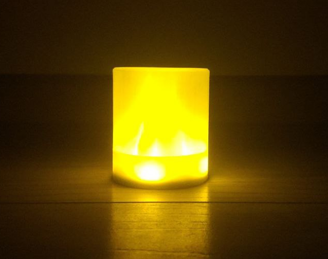
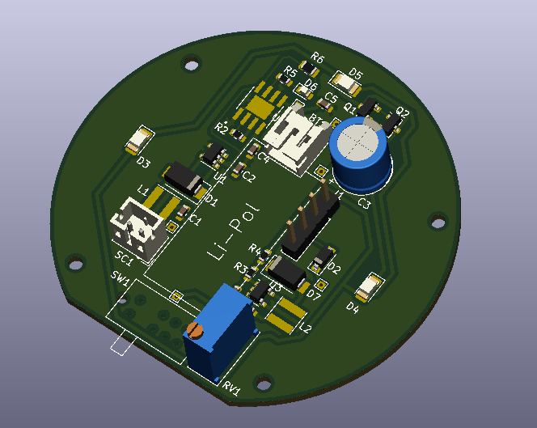

# NightLight

This is device that will shade some light on your road to the kitchen at night :)

Well, this is simple electric LED light that powers from small Li-Pol cell (around 60 mAh capacity).

It supports three modes:
- **Off** - no light, charging enabled
- **Always on** - light always on
- **On for a period of time after motion detected** - yep, I've integrated a cheap microwave motion detector. When it triggers - the light turns on for approximately 3 minutes (that is enough time to grab something tasty in the kitchen and get back) and then turns off automatically.

## 3D View

